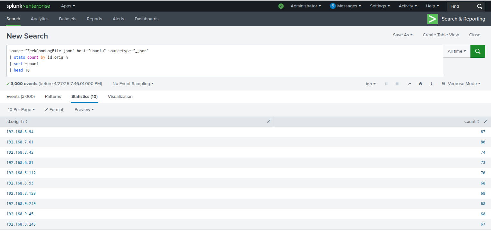
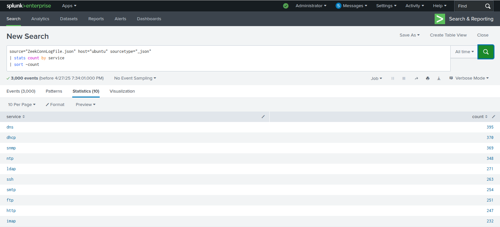
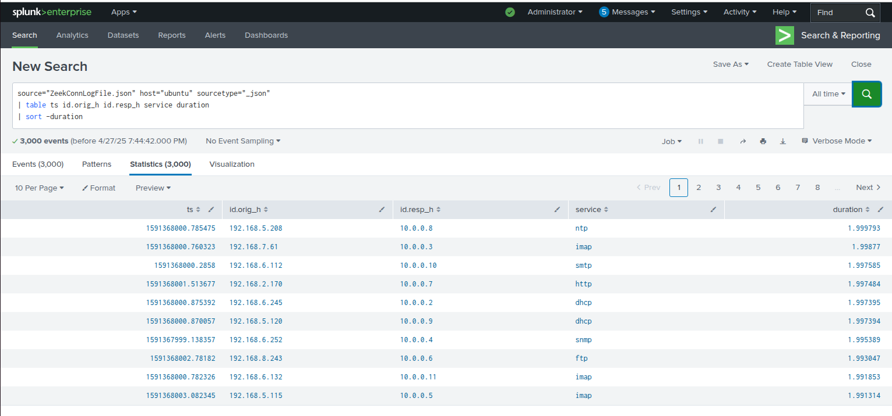
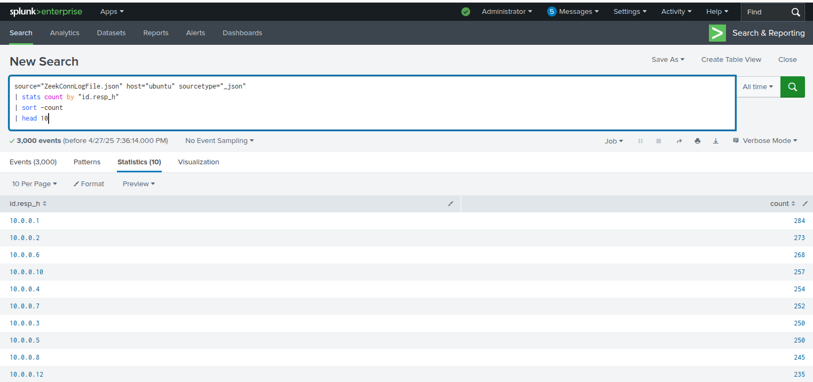

# Day#20: Splunk Basics – Zeek Connection Log Analysis


[](https://zeek.org/)


## 🎯 Objective
Analyze Zeek connection logs in Splunk to:
- Find top clients and servers
- Identify common services
- Detect large traffic and long-duration connections

---

## 🖥️ Lab Setup
- **Splunk:** Installed and accessible.
- **Data Source:** JSON Zeek connection logs.
- **Source Type:** `json` or `zeek:conn`
- **Index:** `conn_lab`

---

## ⚙️ Uploading Zeek Conn Logs to Splunk

1. Splunk Web → **Settings > Add Data**.
2. Select **Upload** → choose `zeek_conn_logs.json`.
3. Set **Source Type**: `json` or create `zeek:conn`.
4. Set **Index**: `conn_lab`.
5. Upload and verify logs are searchable.

---

## 🔍 Lab Tasks

### ✅ Task 1: Top 10 Client IPs
```spl
index=conn_lab sourcetype="json"
| stats count by id.orig_h
| sort -count
| head 10
```

### ✅ Task 2:Most Common Services
```spl
index=conn_lab sourcetype="json"
| stats count by service
| sort -count
```

### ✅ Task 3: Connections > 1 Second
```spl
index=conn_lab sourcetype="json" duration>1
| table ts id.orig_h id.resp_h service duration
| sort -duration
```

### ✅ Task 4: Most Accessed Internal Servers
```spl
index=conn_lab sourcetype="json"
| stats count by id.resp_h
| sort -count
| head 10
```

📚 Skills Demonstrated
- Splunk data ingestion
- Basic SPL (Search Processing Language)
- Zeek connection log analysis
- Cybersecurity data analysis
- Real-world threat hunting techniques

## 4️⃣ Step 4: Capture and Save Screenshots

Now, **open Splunk**, perform each lab **Task**, and:

1. **Run the query**.
2. **Take a screenshot** (query + results visible).
3. **Save each screenshot** inside the `images/` folder.
   
Name your images:
- `task1.png`
- `task2.png`
- `task3.png`
- `task4.png`

---
  
## 5️⃣ Step 5: Connect Screenshots to README










---

## ✍️ Author

**Your Name Here**  
Cybersecurity Enthusiast | Blue Team | SIEM Explorer  
📧 Email: becomingcyber@outlook.com 
🌐 LinkedIn: [Your LinkedIn Profile](www.linkedin.com/in/mozella-mccoy-flowers)

## 📝 License

This project is licensed under the MIT License - see the [LICENSE.md](LICENSE) file for details.
---
