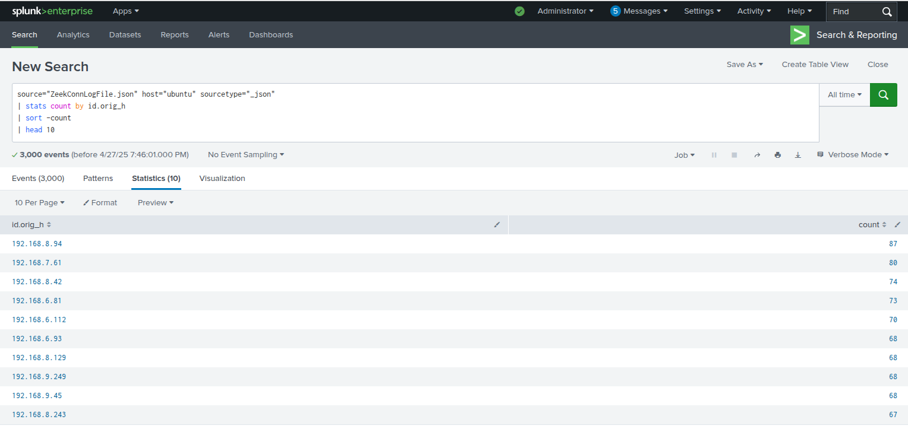
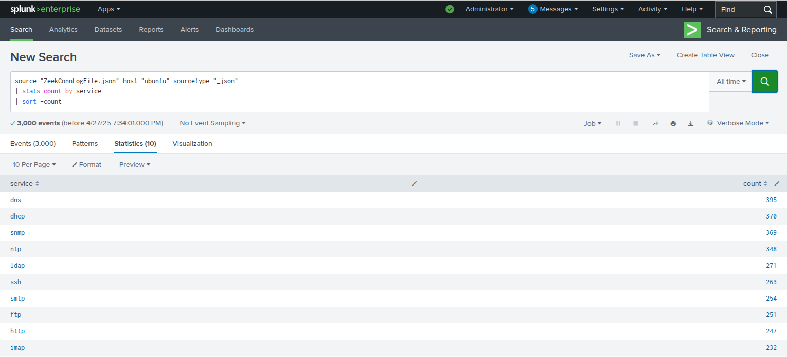
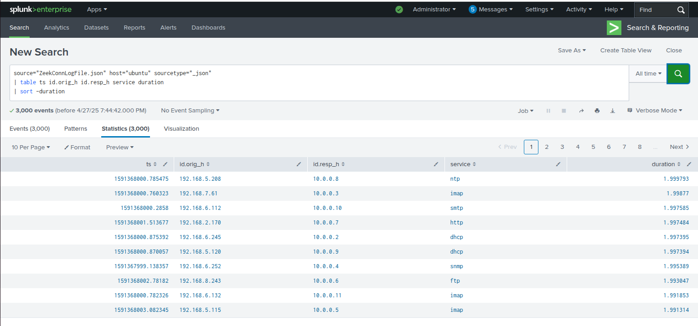
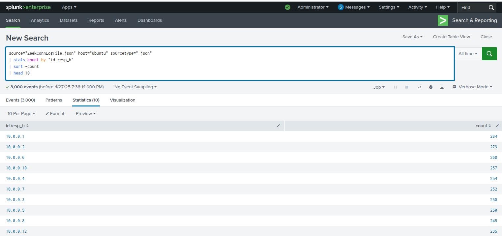

# 📊 Day #20 — Splunk + Zeek Connection Log Analysis

## 🎯 Objective

Analyze Zeek connection logs using Splunk to identify network communication patterns and investigate connection behavior.

The investigation focuses on:

- Identifying the most active client IP addresses
- Determining the most commonly observed network services
- Investigating long-duration connections
- Identifying the most frequently accessed destination servers

This lab demonstrates how Zeek network telemetry can be analyzed within a SIEM to support SOC monitoring and network investigations.

---

## 🖥️ Lab Environment

| Component | Configuration |
|---|---|
| SIEM Platform | Splunk |
| Network Monitoring Data | Zeek Connection Logs |
| Data Format | JSON |
| Sourcetype | `json` / `zeek:conn` |
| Index | `conn_lab` |
| Log Type | Zeek `conn.log` data |

---

## ⚙️ Data Ingestion

Zeek connection logs were uploaded into Splunk and indexed for analysis.

Configuration:

```text
Data Source: zeek_conn_logs.json
Index: conn_lab
Sourcetype: json / zeek:conn
```

After ingestion, the events were verified in Splunk Search & Reporting before beginning the investigation.

---

# 🔎 Investigation

## Question 1 — Which client IP addresses generated the most connections?

```spl
index=conn_lab sourcetype="json"
| stats count by id.orig_h
| sort -count
| head 10
```

This query groups connection events by the Zeek `id.orig_h` field, representing the connection originator, and ranks the most active source systems.

### Evidence



---

## Question 2 — Which services appeared most frequently?

```spl
index=conn_lab sourcetype="json"
| stats count by service
| sort -count
```

This query summarizes connection events by service to identify the protocols or application services most frequently observed in the dataset.

### Evidence



---

## Question 3 — Which connections lasted longer than one second?

```spl
index=conn_lab sourcetype="json" duration>1
| table ts id.orig_h id.resp_h service duration
| sort -duration
```

This query isolates longer-duration connections and displays the source, destination, service, timestamp, and duration for further investigation.

Long-duration connections are not inherently malicious, but they can provide useful leads when investigating unusual network behavior.

### Evidence



---

## Question 4 — Which destination servers received the most connections?

```spl
index=conn_lab sourcetype="json"
| stats count by id.resp_h
| sort -count
| head 10
```

The Zeek `id.resp_h` field represents the responding host. Ranking these systems helps identify frequently contacted servers and communication patterns within the dataset.

### Evidence



---

# 🧠 Investigation Methodology

The investigation followed a basic SOC network-analysis workflow:

1. Ingest Zeek connection telemetry into Splunk.
2. Validate that events were searchable.
3. Establish baseline communication patterns.
4. Identify high-volume source systems.
5. Analyze commonly observed services.
6. Review long-duration connections.
7. Identify frequently contacted destination systems.
8. Preserve query results as investigation evidence.

---

# 🧾 Evidence & Artifacts

| Artifact | Purpose |
|---|---|
| `images/task1.png` | Evidence of most active client IPs |
| `images/task2.png` | Evidence of most common services |
| `images/task3.png` | Evidence of long-duration connections |
| `images/task4.png` | Evidence of most accessed servers |
| `README.md` | Investigation methodology and documentation |

---

# 🛠️ Skills Demonstrated

- Splunk data ingestion
- Search Processing Language (SPL)
- Zeek connection-log analysis
- Network traffic analysis
- Source and destination IP analysis
- Service identification
- Connection-duration analysis
- SIEM-based investigation
- Evidence documentation
- SOC investigation methodology

---

# 🛡️ Security Analysis

Zeek connection logs provide network-level visibility into communication between systems. Fields such as `id.orig_h`, `id.resp_h`, `service`, and `duration` can be used to establish normal communication patterns and identify activity requiring additional investigation.

High connection counts, unusual services, unexpected destinations, and abnormally long connections can serve as investigative leads. These observations should be correlated with additional telemetry before classifying activity as malicious.

---

# 🚀 Planned Engineering Enhancements

This project will be expanded with:

- Structured investigation findings
- Documented SPL queries
- Automated evidence validation
- Python unit testing
- GitHub Actions CI validation
- Security analysis based on observed evidence

---

## ✍️ Author

[](https://github.com/BecomingCyber)

Cybersecurity | Digital Forensics | SOC Operations

📧 Email: becomingcyber@outlook.com 

🌐 LinkedIn: [Mozella McCoy-Flowers](www.linkedin.com/in/mozella-mccoy-flowers)


---

## 📝 License

This project is licensed under the MIT License. See the `LICENSE` file for details.
